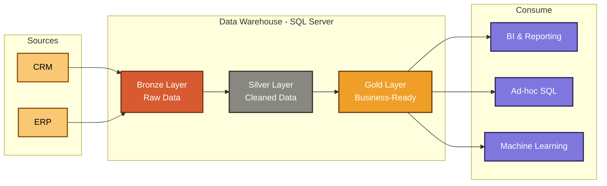

# My Data Warehouse Project 

Welcome to my project! so this is a data warehouse I built from scratch. I think it is a great way to practice data engineering and ETL processes. 

first, I want to talk about the data architecture. I decided to use the Medallion Architecture because it makes sense to me to organize data in stages. 

* **Bronze Layer:** here, i just imported the raw data from CSV files directly into my SQL Server.
* **Silver Layer:** then, i cleaned the data. there was some errors and missing things, so I fixed them and standardized everything.
* **Gold Layer:** last, after cleaning, I created a star schema. I think this is the best way to get it ready for reporting and dashboards.

so what did I actually do in this project?

* I designed the whole DWH architecture.
* I built ETL pipelines to move and transform the data.
* I wrote SQL queries to get some cool insights from the data.

I used tools that are completely free, which is awesome:

* SQL Server Express and SSMS to manage the database.
* Git and GitHub for saving my scripts.

first the main goal was to take sales data from two different systems ERP and CRM. then I had to clean it and merge it into one clear model. I didn't do data historization because I think focusing on the latest data is enough for this scope.

## Data Flow Diagram

